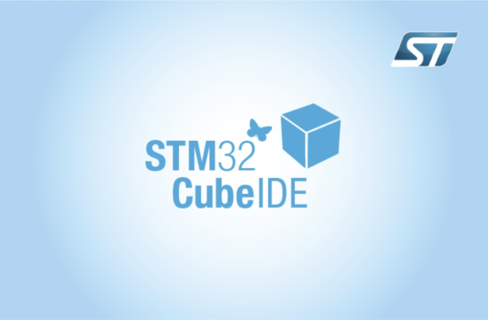
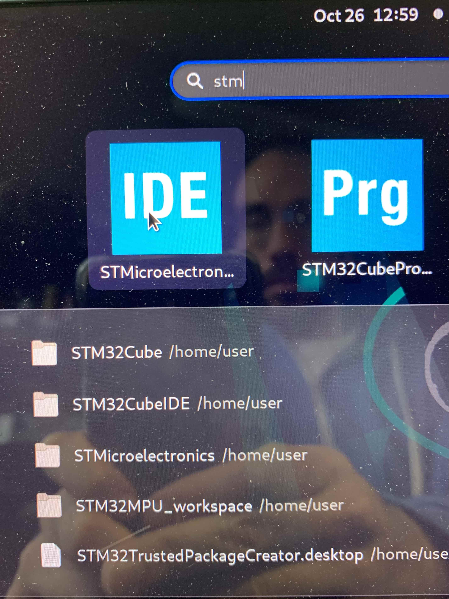
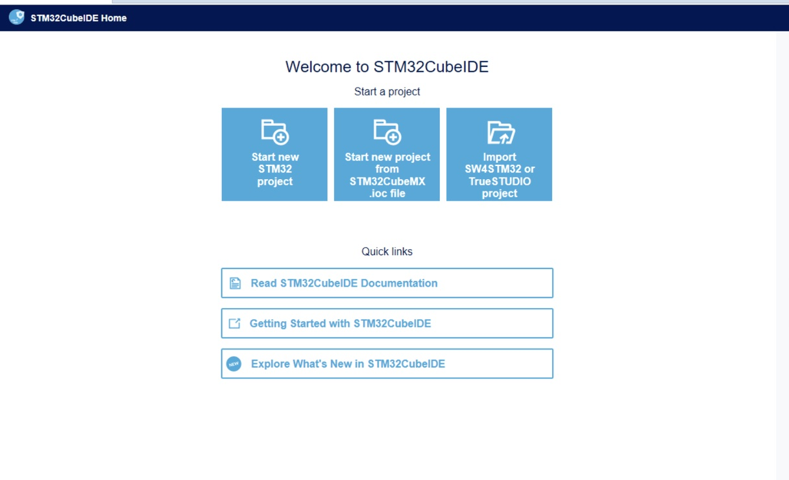
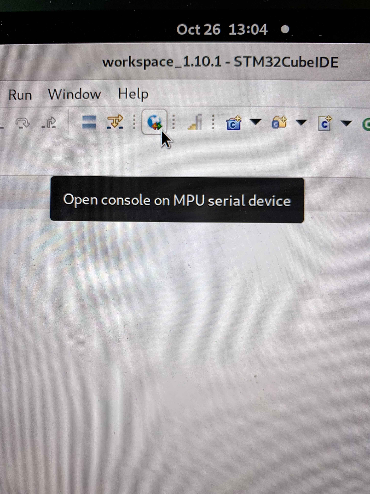
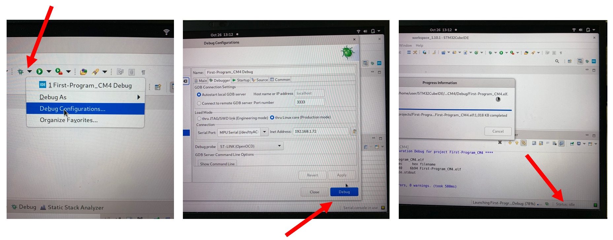

# Install IDE

The STM32MP1 is a heterogeneous device based on a dual-core Arm Cortex-A7 (CA7) and an Arm. Cortex-M4 (CM4) core. Therefore, there are 2 ways you may use STM32MP15 Microprocessor:
(1) We can operate it as a microcomputer with an Operating System, we a terminal, an GUI, and we may create and install our own applications/programs as it's a LINUX computer. Guidelines about those are available in the previous tutorials: **Boot-STM32MP15**, **Execute-Basic-Commands**, **First-Program**.
(2) OR we can operate it as a microprocessor; create a sole program which will be executed in the Cortex-M4 (CM4) core continuously. In the following tutorial we will describe how this can be done.

# Step 1: STM32CubeIDE Installation

The IDE program is an Integrated development environment. While the STM32MP15 is connected to the host computer, we write a program with all the nessesry dependencies of the board automatically generated. we can execute, debug this program in real time while it runs on the STM32MP15 board.

- From the following STM32CubeIDE website: https://www.st.com/en/development-tools/stm32cubeide.html#getsoftware-scroll download the latest software on your Host Computer. As Host Computer for the purposes of the STM32MP15 Microprocessor we name the computer which we will connect with your STM32MP15 Microprocessor and communicate via this computer to the device.

- Then go to this zip file you downloaded and uncompress it in order to get the STM32CubeIDE installers (it doesn’t matter where you save this folder, in the next step you will select in which folder, in particular, this STM32CubeProgrammer will be installed).  

`unzip en.st-stm32cubeide_1.10.1_12716_20220707_0928_amd64.deb_bundle.sh.zip`

- Open a terminal in this directory and execute the Linux installer which the following command:  

`chmod +x st-stm32cubeide_1.10.1_12716_20220707_0928_amd64.deb_bundle.sh`  

`./st-stm32cubeide_1.10.1_12716_20220707_0928_amd64.deb_bundle.sh`

- Now in the application center of your computer the STM IDE will be available. If you go to your GUI applications now you will see STM32 IDE program.

# Step 2: Install STM32CubeMP1 package

- Download the STM32CubeMP1 from: https://www.st.com/en/embedded-software/stm32cubemp1.html#get-software/STM32Cube_FW_MP1_V1.6.0.zip
- Move this file to the "STM32MPU_workspace/STM32MP1-Ecosystem-v4.0.0/Developer-Package" directory 
- Uncompress the archive file to get the STM32CubeMP1 Package
- We will have access to this package through the STM32CubeIDE

# Step 3: Connection

- Start STM32CubeIDE

- Start a new workspace if you do not have one already. In this workspace you may have multiple projects. 

- Collect the STM32MP15 Microprocessor to the host computer with the microusb port, and Check connection to the target board. STM32CubeIDE requires to be connected to Linux running on STM32MP1 device though serial connection. This connection is automatically detected and configured when you have put cable on ST-Link port and board has booted. You can check you can get Linux log and prompt by clicking on the "STM32 butterfly" button :

- After pressing the button, connection is correct if Linux log or prompt are displayed in the console windows:

- Your board might be connected to the PC by Ethernet, either using RJ45 (point to point or VLAN) or USB0 EthernetOverUSB gadget. Now lets make available the connection between the STM32CubeIDE and the STM32MP15 Microprocessor. Press the debug arrow and select "Debug Configuation" check the infromation and press debug. After the process is finished at the bottom right corner you will see the status green.

- So now everything is set and you are ready to write your first program in the IDE.

# References
- https://wiki.st.com/stm32mpu/wiki/Getting_started/STM32MP1_boards/STM32MP157x-DK2/Develop_on_Arm%C2%AE_Cortex%C2%AE-M4/Install_the_IDE
